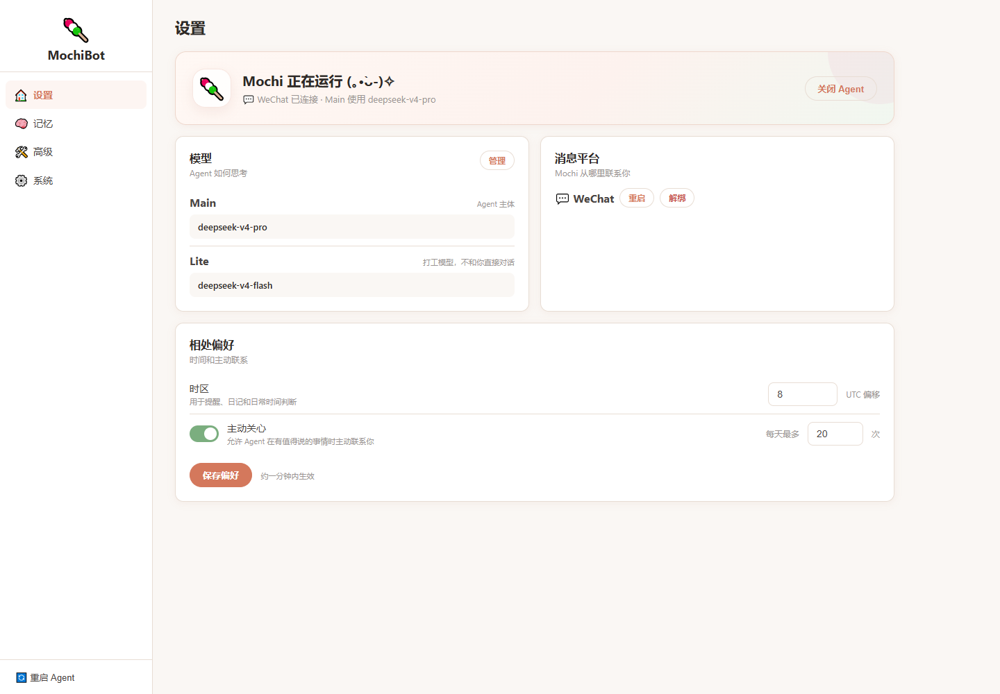

<div align="center">

# 🍡 MochiBot

**住在你自己设备里的轻量 AI 小机**

有长期记忆，会主动关心你，也能帮你管理习惯、提醒和日常琐事。

轻量自托管 · Telegram / 微信 · OpenAI / DeepSeek / Claude / Gemini

</div>



## MochiBot 简介

一款适合长期相处、属于你自己的小机。

Core 从一句“刚刚醒来”开始，随着相处持续修订；具体经历保存在记忆和日记里，不需要先填一套人格模板。

有自己的好奇心和作息，也能记录习惯、待办、提醒、饮食，查询天气和搜索信息。

单用户使用，单进程加 SQLite；管理后台负责配置，日常直接聊天。

## 快速开始

你需要：

- Python 3.11+
- 一个受支持的模型服务 API Key
- Telegram Bot Token，或一个可扫码登录的微信账号

```bash
git clone https://github.com/shikidmsh-rgb/mochibot.git
cd mochibot
```

- **Windows**：双击 `setup.bat`
- **macOS / Linux**：运行 `bash setup.sh`

脚本会创建独立环境、安装依赖并打开管理后台。接下来：

1. 添加模型并测试连接。
2. 将模型分配给 **Main** 和 **Lite**；两者可以使用同一个模型。
3. 配置 Telegram 或微信，启动 MochiBot。
4. 由你发送第一条消息，绑定为唯一用户。

> Bot 对外可见时，请务必先由自己发送第一条消息，避免其他人抢先成为 Owner。

需要逐步说明时，查看[新手上路手册](docs/getting-started.md)。

## 日常使用

大部分功能直接和 Mochi 聊天即可，不需要记工具名称：

- 「这周已经跑了 3 次」「刚才那项待办还没完成，重新打开」
- 「每个工作日九点提醒我」「查一下上周我们怎么说的」
- 「每天最多安排 5 次 Free Time」「你更新一下」

Free Time 每天随机安排，不是必须发满的消息配额；正在聊天、休息或错过时机时，不补发过期的主动消息。Mochi 可以主动查看已有的生活状态，不会被另一个 Attention 通道定时分派观察任务。

固定通知直接发送已保存的原文；Self Reminder 是 Mochi 留给未来自己的回望点，到时再决定是否行动或说话。

## 模型支持

| 提供商 | 接入方式 |
| --- | --- |
| OpenAI / GPT | OpenAI API |
| DeepSeek | 官方 OpenAI-compatible 接口 |
| Anthropic / Claude | Anthropic API |
| Google Gemini | 官方 OpenAI-compatible 接口 |

**Main** 是和你聊天的 Mochi，负责性格、判断和回复；**Lite** 在后台做分类、摘要和记忆整理。未分配 Lite 时不会偷偷让 Main 代替分类。

还可配置 HTTPS OpenAI-compatible API 根地址；第三方的工具、图片和参数支持以其实际实现为准。Telegram 和微信均支持接收单张、5 MB 以内的图片，取决于 Main 模型的看图能力；微信支持 JPG、PNG、GIF、WebP。图片交给当前 Main 直接理解，不另设识图模型；原图仅用于当轮对话，不保存到聊天历史。

语义向量记忆是可选功能；不配置时仍可全文召回。Embedding 支持 OpenAI、阿里云百炼和 Azure AI Foundry 的 OpenAI-compatible 接口。

后台「模型 → 图片生成」可独立配置生图模型，不改变 Main / Lite。支持 OpenAI Images
及 Gemini 原生 `generateContent`：官方地址自动匹配，中转或自建地址手动选择接口类型，
同协议换模型无需改代码。后台仅管理配置，不生成、上传或发送图片。
配置完整并启用图片生成 Skill 后，Mochi 可在微信聊天中按需生成和发送图片；Telegram 和主动消息暂不支持。

## 主要能力

| 能力 | 能做什么 |
| --- | --- |
| 长期记忆 | 持续整理对话、重要经历、关系和 Core；双方历史包含完整时间 |
| 日记 | 查看今日状态，完整编辑今天的日记，给明天留下草稿 |
| 主动陪伴 | 每日随机 Free Time，跟随清醒与休息，不在正在聊天时插话 |
| 习惯 | 自然语言创建、累计进度对账、打卡和暂停 |
| 待办与提醒 | 待办完成或重新打开；一次性、循环、可修改的提醒 |
| 饮食 | 按食物记录估算值，程序求总量，按记录 ID 删除 |
| 本地历史搜索 | 按关键词找回聊天、日记和记忆，结果带来源时间 |
| 搜索与天气 | Tavily、百度千帆或免密钥 Bing；Open-Meteo 当前天气 |
| 表情包 | 学习并发送 Telegram Sticker |
| 聊天搬家 | 从 ChatGPT 导出记录生成可预览的 Core 和记忆草稿 |
| 个人工作区 | 自主保存 Markdown 资料，开发、调试和启用个人工具 |
| 自助更新 | 用户提出请求时检查官方正式版；先送达回复，再执行更新退出 |

相关技能可以在管理后台开关。工具根据当前需要加载；可自适应调整的工具会参考实际成功使用情况，Mochi 也可以自己管理加载方式。

记忆自动去重只忽略空白差异，不会因为文字或向量相似就丢弃改口、修正或补充；不同内容保留为独立记忆，不自动覆盖旧记录。

个人开发默认开启，不需要修改官方源码或手动重启。个人代码和数据保存在 `data/`，官方更新不会覆盖；运行的是可信本地 Python，不是沙箱。后台可以关闭开发能力，已有资料仍可读取。详见[个人扩展](docs/extensions.md)。

## 聊天命令

Telegram 和微信均支持以下命令；除 `/help` 外仅对 Owner 生效。

| 命令 | 说明 |
| --- | --- |
| `/help` | 查看命令帮助 |
| `/heartbeat` | 查看主动陪伴运行状态 |
| `/cost` | 查看今日、本月 Token 总量及各模型明细 |
| `/core` | 查看 Core |
| `/diary` | 查看今日日记 |
| `/skilloff` | 暂时进入轻量闲聊模式 |
| `/skillon` | 恢复完整能力 |
| `/reset` | 清空后续对话可见的短期上下文，保留数据库和长期记忆 |
| `/restart` | 重启 MochiBot |

## 数据放在哪里

- `data/`：数据库、Core、Diary、个人资料、扩展和运行数据。
- `.env`：Bot Token、管理后台和基础配置，请勿提交或分享。
- 模型 API Key：设置了管理后台访问 Token 后，加密存入数据库。

备份应包含 `data/` 和 `.env`；`ADMIN_TOKEN` 同时用于解密已保存的凭据，不要随意替换。聊天内容、图片和搜索词会发送给你选择的模型或搜索服务，不经过 MochiBot 官方服务器。

## 更新与部署

Git 安装可以直接在聊天里让 Mochi 更新。它只在用户请求时检查 GitHub 官方正式 Release，不会每天轮询；更新保留 `.env`、`data/` 和个人扩展。

要使用聊天中的自助更新，进程管理器须启动 `scripts/start.py`，不能直接运行 `python -m mochi.main`。例如，systemd 的启动命令可设为：

```ini
ExecStart=/path/to/mochibot/.venv/bin/python /path/to/mochibot/scripts/start.py
```

也可先关闭 MochiBot，再手动更新：

- **Windows**：双击 `update.bat`
- **macOS / Linux**：

```bash
git pull
source .venv/bin/activate
pip install -r requirements.txt
bash setup.sh
```

有未提交源码改动或分支冲突时，先检查并整合，不要用覆盖或强推解决。

Docker 适合由宿主机维护镜像的环境，**不支持聊天中的自助更新**：

```bash
git clone https://github.com/shikidmsh-rgb/mochibot.git
cd mochibot
cp .env.example .env
docker compose up -d
```

管理后台默认只监听 `127.0.0.1:8080`。远程部署推荐 SSH 隧道，不会通过聊天发送后台凭据：

```bash
ssh -L 8080:127.0.0.1:8080 user@your-server
```

随后在本地浏览器打开 `http://127.0.0.1:8080`。如果使用反向代理，请配置 HTTPS 和后台访问 Token。

## 开发与个性化

- 性格、语气和关系上下文：管理后台中的 Core。
- 运行参数：[.env.example](.env.example) 与管理后台。
- 架构边界：[architecture.md](docs/architecture.md)。
- 内置技能开发：[SKILL_SPEC.md](docs/SKILL_SPEC.md)。
- 个人扩展：[extensions.md](docs/extensions.md)。
- 版本变化：[CHANGELOG.md](CHANGELOG.md)。

## 许可证

[MIT](LICENSE)
