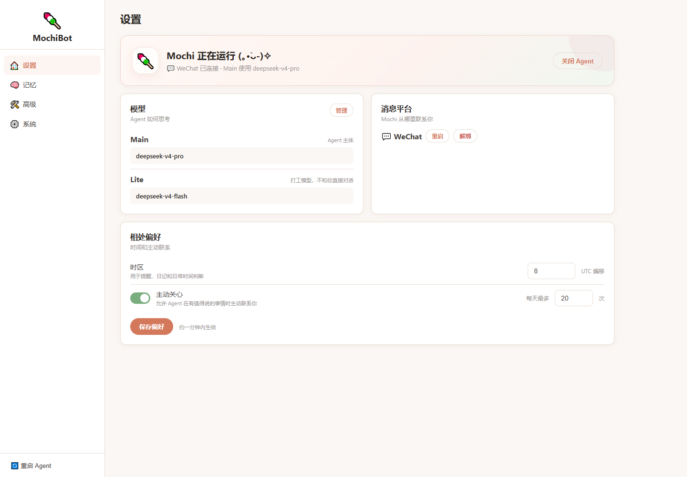

# 🍡 MochiBot

**1V1 聊天陪伴小机，适合小白用户**

欢迎大家使用、参考或在此之上魔改。

完全开源，自己存储数据，用自己的 API Key 运行。

目前还在持续更新中~ 交流反馈可戳某 red book 两仪七月

轻量自托管 · Telegram / 微信 · OpenAI / DeepSeek / Claude / Gemini

## MochiBot Agent 简介

面向单主人使用，注重长期感情链接、记忆力、主动消息和生活关怀。定位可以是生活管家、人机恋陪伴，或者日常小助手。

主动消息有，但感觉还不够灵，进化中 ing。

可以在框架基础上自行接入更多内容，比如米家、Oura 等设备数据或 API，也可以自行开发 UI。目前开源版本包含管理后台，未包含上述设备集成或自定义聊天界面。

### 个人使用 case，供参考

追踪 habit、todo，管理健康、饮食和健身，记录灵感，以及辅助管理猫砂盆和米家所有设备。其中设备相关能力为自行接入，不属于开源版内置功能。

## 快速开始

1. 下载[最新正式版](https://github.com/shikidmsh-rgb/mochibot/releases/latest)，Windows 运行 `setup.bat`，macOS / Linux 运行 `bash setup.sh`。
2. 在管理后台配置 Main / Lite 和聊天平台，保存偏好并启动。
3. 由你发送第一条消息，完成绑定并开始聊天。

完整安装、配置和更新步骤见[使用指南](docs/getting-started.md)。

## 日常使用

- 多聊天，ta 就会自动记住很多东西。
- ta 能查看自己有哪些 skill 和配置，问就行了。
- ta 有自己的工作空间，可以写文档、加 skill；harness 目前还比较局限。
- Git 安装的版本，按使用指南启动后，可以直接让 ta 更新到 GitHub 上的最新正式版。

### Core（重要）

core是最重要的agent核心！！！虽然他自己也会写但是靠谱度不确定，所以建议常常维护常看常新，必要的内容直接自己更新进去，是和机体验最重要的一个环节~

在管理后台「记忆」页面查看和编辑 Core。

## 记忆力说明

ta 的记忆力由以下几部分组成：

| 组成 | 作用 |
| --- | --- |
| Core | 重要核心！每次都必带的信息！ |
| 近期记忆 | 最近对话 + 摘要 |
| 日记 | ta 的每日小本本，每天一本 |
| 关系图 | 重点人物和宠物信息 |
| 记忆条（长期记忆） | 记忆小纸条，按需找回 |

工作区还能保存文档、资料和小指南，由 ta 按需查阅，不会每轮自动全部读入。过去的聊天、日记和记忆也可以主动搜索。

不是每句话都会变成长期记忆，也不是每次都会完整读取全部历史。

## 模型支持

支持 **OpenAI / GPT、Anthropic / Claude、DeepSeek、Google Gemini**，以及 OpenAI 兼容接口。并非所有模型都经过实测，具体型号、工具调用和看图能力需要自行测试。

## 主要能力

| 能力 | 能做什么 |
| --- | --- |
| 长期记忆 | 记住聊天中的经历、偏好和重要信息，之后按需找回 |
| 日记 | 写日记、查看今日状态、回看过去的日记 |
| 主动陪伴 | 有自己的作息和自由活动，可以主动联系你 |
| 习惯 | 创建习惯、打卡、查看进度、暂停或恢复 |
| 待办与提醒 | 管理待办；设置、修改或取消一次性和重复提醒 |
| 饮食 | 记录饮食、估算热量和营养、查看每日摄入汇总 |
| 历史搜索 | 找回过去的聊天、日记和记忆 |
| 看图 | Telegram、微信均支持单张 5 MB 以内的图片，需要模型具备看图能力 |
| 生图 | 在微信聊天中生成并发送图片，需要单独配置生图服务 |
| 文件读取 | 微信支持文本、代码、CSV、PDF 和 Word（.docx），单文件 20 MB 以内，最多提取前 20,000 字；不支持扫描件 OCR |
| 搜索与天气 | 联网搜索信息，查询所设城市的当前天气 |
| 表情包 | 学习并发送 Telegram 表情包 |
| 聊天搬家 | 从 ChatGPT 导出记录生成 Core 和记忆草稿，确认后导入 |
| 个人工作区 | 保存自己的文档和小指南，开发、启用个人 skill |
| 自助更新 | 在聊天中检查和安装 GitHub 正式版更新，需要 Git 安装 |

个人开发默认开启，可在后台「设置 → 高级」关闭；关闭开发不会停用已安装的工具。个人工具会在运行 Mochi 的机器上执行 Python 代码，不是沙箱。个人代码和资料随数据一起保存，更新不会覆盖。详见[个人扩展](docs/extensions.md)。

## 聊天命令

Telegram 和微信均支持以下命令；除 `/help` 外仅对 Owner 生效。

| 命令 | 说明 |
| --- | --- |
| `/help` | 查看命令帮助 |
| `/heartbeat` | 查看主动陪伴运行状态 |
| `/cost` | 查看今日、本月 Token 总量及各模型明细 |
| `/core` | 查看 Core |
| `/diary` | 查看今日日记 |
| `/skilloff` | 暂时进入轻量闲聊模式 |
| `/skillon` | 恢复完整能力 |
| `/reset` | 清空后续对话可见的短期上下文，保留数据库和长期记忆 |
| `/restart` | 重启 MochiBot |

`/cost` 展示 Token 用量，实际费用以服务商账单为准。

## 数据放在哪里

- `data/`：数据库、Core、Diary、个人资料、扩展和运行数据。
- `.env`：Bot Token、管理后台和基础配置，请勿提交或分享。
- 模型 API Key：保存在数据库；保存时已配置 `ADMIN_TOKEN` 且加密组件可用才会加密，否则可能明文存储。

备份应包含 `data/` 和 `.env`；`ADMIN_TOKEN` 同时用于解密已保存的凭据，不要随意替换。聊天内容、图片、文件文字和搜索词会发送给你选择的模型或搜索服务，不经过 MochiBot 官方服务器。

## 更新与部署

通过 Git 安装正式版并使用启动脚本运行时，可以在聊天里让 Mochi 更新。聊天更新只检查官方正式 Release，手动更新也选择对应的版本标签；更新保留 `.env`、`data/` 和个人扩展。

支持本地或云服务器运行，管理后台默认仅监听本机。手动更新、服务器部署与后台访问步骤见[使用指南](docs/getting-started.md)。

需要未发布改动时，可选择 [main 开发版](https://github.com/shikidmsh-rgb/mochibot/tree/main)，不作为默认安装版本。

## 开发与个性化

- 性格、语气和关系上下文：管理后台中的 Core。
- 运行参数：[.env.example](.env.example) 与管理后台。
- 架构边界：[architecture.md](docs/architecture.md)。
- 内置技能开发：[SKILL_SPEC.md](docs/SKILL_SPEC.md)。
- 个人扩展：[extensions.md](docs/extensions.md)。
- 版本变化：[CHANGELOG.md](CHANGELOG.md)。

## 许可证

[MIT](LICENSE)
